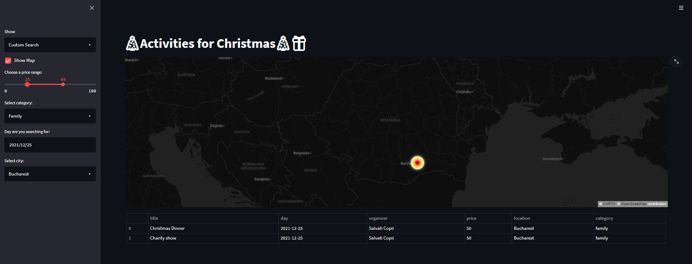
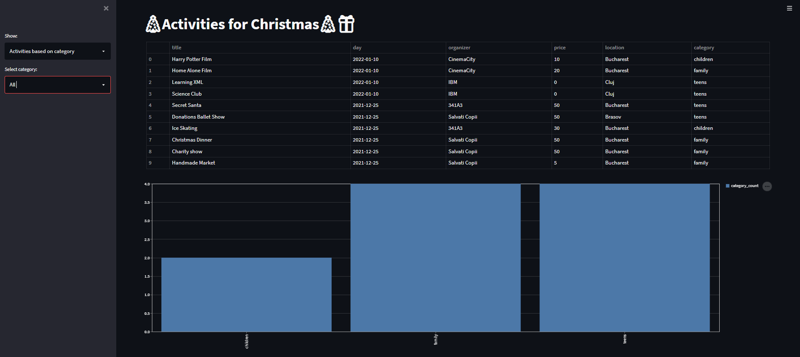

# XML-Parser
   XML-Parser is an application that processes the reading of an XML document and provide with Streamlit an interface to the user application for accessing the content of the file.

## Overview App




## Technologies

- [Pyton 3.8.10](https://www.python.org/downloads/release/python-3810/)
- [Streamlit](https://docs.streamlit.io/)
- [The ElementTree XML API](https://docs.python.org/3.8/library/xml.etree.elementtree.html)

## Run App

```bash
  git clone https://github.com/iuliiaioana/XML-Parser.git
  cd XML-Parser
  pip install -r requirements.txt
  streamlit run app.py
```
